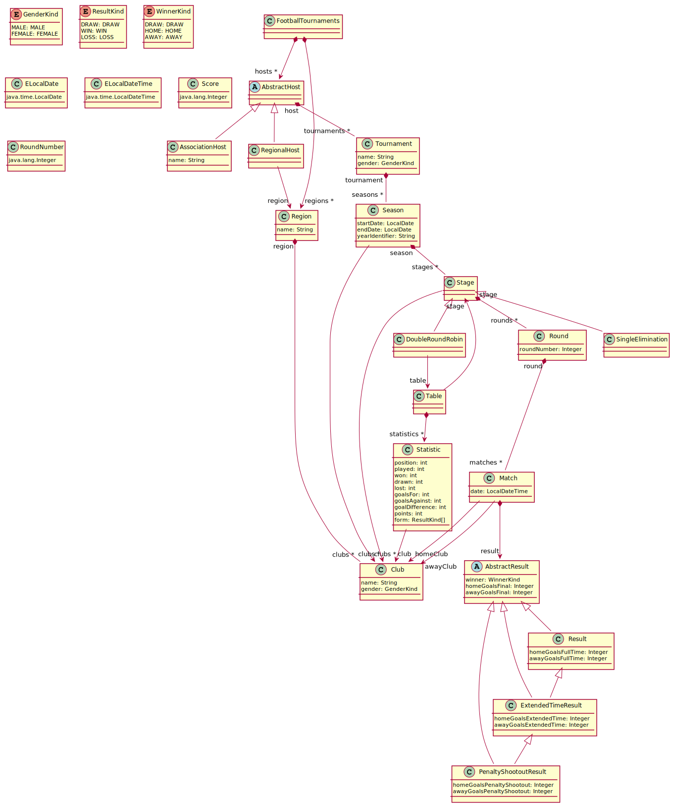

# Football Tournaments

An Ecore project for modeling the domain of football tournaments, based on [NRK's football tournament pages](https://resultater.nrk.no/fotball/1/turneringer).

## Table of Contents
  - [Prerequisites](#prerequisites)
  - [Installation](#installation)
  - [Usage](#usage)
  - [Domain](#domain)
  - [Model Instances, Webpages and Screenshots](#model-instances-webpages-and-screenshots)
  - [Model Implementation](#model-implementation)
  - [Tests](#tests)

## Prerequisites
To be able to use the model in a development or test environment, the following is required:
* [Java JDK](https://www.oracle.com/java/technologies/downloads/)
* [Eclipse IDE for Java and DSL Developers](https://www.eclipse.org/downloads/packages/)

## Installation
### 1. Install Additional Software in Eclipse IDE
* Go to _Help_ -> _Install New Software..._ in the top navigation.
* Select and install the following:
    * From the standard software site (select your Eclipse version in the dropdown):
        * Acceleo
        * Ecore Diagram Editor (SDK)
        * EMF Forms SDK
        * Sirius Specifier Environment
        * Sirius Properties Views - Specifier Support
    * Uncheck _Group Items by Category_, from the standard software site:
        * Acceleo Query SDK
    * From the software site _http://hallvard.github.io/plantuml_:
        * PlantUML Ecore Feature
        * PlantUML Feature
        * PlantUML Library Feature
* [Graphviz](https://graphviz.org/download/) may be needed for older PlantUML versions (check [here](https://plantuml.com/graphviz-dot)).

### 2. Clone and Import Repository
* Clone the repository with:

    ```
    git clone https://gitlab.stud.idi.ntnu.no/TDT4250/h2021-ecore-assignments/runarsae.git
    ```

* Import the projects `ft`, `ft.edit`, `ft.editor`, `ft.instances` and `ft.tests` from the repository location to your Eclipse workspace using _File_ -> _Import..._ in the top navigation, and then choosing _Projects from Folder or Archive_ under _General_. 

## Usage
To create, view and edit instances of the model, the recommended way is to create a testing environment where the model is loaded: 
1. Go to _Run_ -> _Run Configurations..._ in the top navigation in Eclipse.
2. Right-click _Eclipse Application_ in the left list, and choose _New Configuration_. Give the configuration a name. 
3. In the _Plug-ins_ tab, make sure `ft`, `ft.edit` and `ft.editor` are all selected (`ft.tests` is not needed). Apply the changes and run the environment. A new Eclipse will open where the model is loaded. 
4. Import projects (for example `ft.instances` and `ft.tests`) or create a new one (Plug-in Project) in order to create, view and edit files with an _.ft_ extension (intances of the model).
5. To create a new _.ft_ file/instance of the model, right-clik the desired location in the project/package explorer and choose _New_ -> _Others.._. Under _Example EMF Model Creation Wizards_, choose _Ft Model_ and follow the wizard.

See the [model instances, webpages and screenshots](#model-instances-webpages-and-screenshots) section for pointers to pre-made instances that can be viewed using the test environment.

## Domain
The domain of football tournaments consists of several concepts (delimited to the project scope):
* **Host** - A generic concept of an organizer of tournaments. 
* **Association host** (Host) - A special kind of host representing an association. Has a name. Examples are UEFA and FIFA. 
* **Regional host** (Host) - A special kind of host representing a region. 
* **Region** - A geographical area. Has a name and can have several clubs in it. Examples are Norway, England and Germany.
* **Club** - A football club based in a region, with name and gender.
* **Tournament** - A tournament hosted by a specific host and for a specific gender. Can have several seasons.
* **Season** - A period of time containing one or more stages, and has clubs that competes against each other.
* **Stage** - A generic concept with rounds and clubs (no constraints).
* **Double round-robin** (Stage) - A special kind of stage where each club meets every other club in the stage two times, one at home and one away. Has a table showing statistics for the stage.
* **Single-elimination** (Stage) - A special kind of stage where the loser of each match is eliminated from the stage. The winners of a match will advance to the next round, until two clubs are left playing the final.
* **Table** - Contains statistics for each club in a stage.
* **Statistic** - Statistics for a specific club in a stage, including position, matches played, won, drawn, lost, how many goals scored for and against, the goal difference, how many points the club has, and the club's form the last six matches in the stage.
* **Round** - A round of a stage. Has a round number, and can contain one or more matches.
* **Match** - A football match between a home club and an away club at a specific date within the season. Has a result attached to it if the match has been played.
* **Result** - The result of a match. Includes the number of goals for the home and away club, and the winner. Can be extended with result for extended time and penalty shoot-out.

Some examples in the real world where the domain applies are Eliteserien, NM cup for men, OBOS-ligaen, Toppserien, Premier League and Bundesliga.

## Model Instances, Webpages and Screenshots
Instances of the model have been made to match the tournaments with seasons listed in the tables below. The corresponding web pages and screenshots are also listed. All instances are located in the `ft.instances` project.

Since a whole tournament has hundreds of matches, the instances are made by running `ft.instances/src/ft.util/FetchData.java`. This script reads match information from .csv files located in `ft.instances/datasets/` and generates the corresponding model instances.

The 2021 and 2021/2022 seasons are currently running at the time of writing (15.09.2021), so the web pages for these seasons may have changed and will not match the instances. Please refer to the screenshots if so.

**Note**: Open the instance files using a testing environment, as described in the [usage](#usage) section.

### Norwegian Football Tournaments
Instance file: `ft.instances/instances/NorwegianTournaments.ft`

|**Tournament**|**Season**|**Webpages**|**Screenshots**|
|:----|:----|:----|:----|
|Eliteserien|2021 (per 15.09.2021)|[Table](https://resultater.nrk.no/fotball/1/turneringer/5/2021/tabell) - [Results](https://resultater.nrk.no/fotball/1/turneringer/5/2021/resultater) - [Matches](https://resultater.nrk.no/fotball/1/turneringer/5/2021/kamper)|[Table](documentation/screenshots/eliteserien_2021_table.png) - [Results](documentation/screenshots/eliteserien_2021_results.png) - [Matches](documentation/screenshots/eliteserien_2021_matches.png)|
|Eliteserien|2020|[Table](https://resultater.nrk.no/fotball/1/turneringer/5/2020/tabell) - [Results](https://resultater.nrk.no/fotball/1/turneringer/5/2020/resultater)|[Table](documentation/screenshots/eliteserien_2020_table.png) - [Results](documentation/screenshots/eliteserien_2020_results.png)|
|Eliteserien|2019|[Table](https://resultater.nrk.no/fotball/1/turneringer/5/2019/tabell) - [Results](https://resultater.nrk.no/fotball/1/turneringer/5/2019/resultater)|[Table](documentation/screenshots/eliteserien_2019_table.png) - [Results](documentation/screenshots/eliteserien_2019_results.png)|
|Toppserien|2021 (per 15.09.2021)|[Table](https://resultater.nrk.no/fotball/1/turneringer/19/2021/tabell) - [Results](https://resultater.nrk.no/fotball/1/turneringer/19/2021/resultater) - [Matches](https://resultater.nrk.no/fotball/1/turneringer/19/2021/kamper)|[Table](documentation/screenshots/toppserien_2021_table.png) - [Results](documentation/screenshots/toppserien_2021_results.png) - [Matches](documentation/screenshots/toppserien_2021_matches.png)|
|Toppserien|2020|[Table](https://resultater.nrk.no/fotball/1/turneringer/19/2020/tabell) - [Results](https://resultater.nrk.no/fotball/1/turneringer/19/2020/resultater)|[Table](documentation/screenshots/toppserien_2020_table.png) - [Results](documentation/screenshots/toppserien_2020_results.png)
|NM Cup|2021 (per 15.09.2021)|[Results](https://resultater.nrk.no/fotball/1/turneringer/14/2021/resultater) - [Matches](https://resultater.nrk.no/fotball/1/turneringer/14/2021/kamper)|[Results](documentation/screenshots/nm_cup_2021_results.png) - [Matches](documentation/screenshots/nm_cup_2021_matches.png)
|NM Cup|2019|[Results](https://resultater.nrk.no/fotball/1/turneringer/14/2019/resultater)|[Results](documentation/screenshots/nm_cup_2019_results.png)

### English Football Tournaments
Instance file: `ft.instances/instances/EnglishTournaments.ft`

|**Tournament**|**Season**|**Webpages**|**Screenshots**|
|:----|:----|:----|:----|
|Premier League|2021/2022 (per 15.09.2021)|[Table](https://resultater.nrk.no/fotball/1/turneringer/7/2022/tabell) - [Results](https://resultater.nrk.no/fotball/1/turneringer/7/2022/resultater) - [Matches](https://resultater.nrk.no/fotball/1/turneringer/7/2022/kamper)|[Table](documentation/screenshots/premier_league_2021_2022_table.png) - [Results](documentation/screenshots/premier_league_2021_2022_results.png) - [Matches](documentation/screenshots/premier_league_2021_2022_matches.png)|
|Premier League|2020/2021|[Table](https://resultater.nrk.no/fotball/1/turneringer/7/2021/tabell) - [Results](https://resultater.nrk.no/fotball/1/turneringer/7/2021/resultater)|[Table](documentation/screenshots/premier_league_2020_2021_table.png) - [Results](documentation/screenshots/premier_league_2020_2021_results.png)|

The derived table of the Premier League season 2020/2021 can be printed by running the `ft.instances/src/ft.util/PrintTable.java` file.

## Model Implementation
The Ecore model is located in the `/ft/model/ft.ecore` file along with a `ft.genmodel` file for generating code based on the model. Below is a generated UML diagram for the model.



### Classes
The modeled classes directly maps to the concepts described in the [domain](#domain) (except the root class, `FootballTournaments`, which contains regions and hosts). 

Every class is implemented as ordinary classes, except `AbstractHost` and `AbstractResult`. They are abstract, as a host can be either an association or a region and a result can either be a generic result, extended time result or penalty shoot-out result. 

The `DoubleRoundRobin` and `SingleElimination` classes are inheriting from the `Stage` class, as they are special kinds of stages with custom contents and constraints on rounds, matches and results. For example, a double round-robin stage has a derived reference to a table showing statistics, and has constraints to make sure every club in the stage meets every other club at home and away once. The `Stage` class is not abstract on purpose, so that other types of stages can be modeled. 

**NOTE**: Double round-robin and single elimination are the two stages the domain is delimited to and has been focused on. There are many other kinds of stages in different tournaments which would be too time consuming to model in this project scope.

### Data Types and Enums
Four data types are modeled:
* `ELocalDate` and `ELocalDateTime` to support dates and time. These are based on the LocalDate and LocalDateTime types in Java (java.time package). 
* `Score` for representing the number of goals scored for a club. It must be 0 or higher.
* `RoundNumber` for representing the number of a round. It must be 1 or higher.

The model has three enums:
* `GenderKind` - Specifies a gender, either MALE or FEMALE. Used to set gender for tournaments and clubs.
* `WinnerKind` - Specifies the winner of a match, either DRAW, HOME or AWAY. Used to set the winner of a match.
* `ResultKind` - Specifies a winner of a match from a club's point of view, either DRAW, WIN or LOSS. Used to set the form of a club.

### Attributes
The types used on attributes are EString, EInt, and custom data types and enums.

The attributes implemented have different multiplicities. Most have a lower bound and upper bound of 1, saying that one value must be set (for example _name_ and _gender_ in the `Tournament` class). The _form_ attribute of `Statistic` has upper bound set to 6, stating that it can have up to 6 match results.

### References
Containment references are used create a hierarchy of classes, with the `FootballTournaments` class at the root. All classes are contained in another, except the root class and `Table`. The reference to `Table` is derived and transient, so it does not make sense to make it contained in the `DoubleRoundRobin` stage.

Ordinary references are also used. The `Season`, `Stage` and `Match` classes have references to the `Club` class, representing which clubs are playing in the season/stage/match. `Statistic` also has a reference to `Club`, indicating which club the statistic is for. Another reference is from `RegionalHost` to `Region`, indicating what region a regional host is representing. `Table` has a reference to `Stage`, which is a pointer to the stage the table represents.

Opposites are used to model mutual references between classes. Examples are between `AbstractHost` and `Tournament`, indicating that if a host has a tournament, the tournament must also have the same host. Other examples are between `Tournament` and `Season`, `Season` and `Stage`, `Stage` and `Round` and so on.

The references used also have different multiplicities, for example a tournament can have multiple seasons and a match can only have one result.

### Constraints
The table below lists all constraints implemented, including which class or data type they are in, their name, description, and whether they are manually written, implemented in OCL or using the ExtendedMetaData EAnnotation. Manually written constraints can be found in `ft/src/ft.util/FtValidator.java`, while OCL and ExtendedMetaData constraints are implemented in the `ft/model/ft.ecore` file.

|**Class / Data Type**|**Name**|**Description**|**Manually written / OCL / ExtendedMetaData**|
|:----|:----|:----|:----|
|RegionalHost -> Host|clubsInTournamentSeasonsMustBeInRegion|Tournaments hosted by a regional host are regional; clubs must be in the region the host represents|OCL|
|Region|clubsMustBeUnique|Clubs in a region must be unique in terms of name and gender|OCL|
|Season|startDateMustBeBeforeEndDate|Season start date must be before end date|Manually written|
|Season|clubsGenderMustBeEqualToTournamentGender|The gender of the clubs in the season must be the same as the gender for the tournament|OCL|
|Stage|roundNumbersMustBeUnique|Round numbers must be unique witihin the stage|OCL|
|Stage|clubsInStageMustBeInSeason|The clubs in the stage must be in the season this stage is in|OCL|
|DoubleRoundRobin -> Stage|numberOfRoundsIsCorrect|Number of rounds must be maximum log2(number of clubs - 1) * 2|OCL|
|DoubleRoundRobin -> Stage|roundNumbersMustBeInValidRange|Round number must be in range from 1 to (number of clubs - 1) * 2, inclusive|OCL|
|DoubleRoundRobin -> Stage|everyClubMustMeetEveryOtherClubHomeAndAwayOnce|Every club in the stage must meet every other club at home and away once|OCL|
|DoubleRoundRobin -> Stage|numberOfMatchesInEachRoundIsCorrect|Number of matches in each round equals number of clubs / 2|OCL|
|DoubleRoundRobin -> Stage|noExtendedTimeOrPenaltyShootout|The result of each match must be a generic result, i.e. no extended time or penalty shoot-out|OCL|
|SingleElimination -> Stage|numberOfRoundsIsCorrect|Number of rounds must be maximum log2(number of clubs)|Manually written|
|SingleElimination -> Stage|roundNumbersMustBeInValidRange|Round number must be in range from 1 to log2(number of clubs), inclusive|Manually written|
|SingleElimination -> Stage|numberOfMatchesInEachRoundIsCorrect|Round _i_ (starting from 1) must have 2^(log2(number of clubs) - _i_) matches|Manually written|
|SingleElimination -> Stage|everyClubMustHaveWonInPreviousRound|For round _i_ > 1, each club in match must have won in the previous round _i_ - 1|Manually written|
|SingleElimination -> Stage|matchesMustHaveAWinner|Every match must have a winner, i.e. not draw|Manually written|
|Round|clubsInRoundMatchesMustBeUnique|A club cannot be in more than one match per round|OCL|
|Match|homeClubAndAwayClubCannotBeTheSame|Home club and away club in a match cannot be the same|OCL|
|Match|homeClubMustBeInStage|Home club must be in the stage where the match is played|OCL|
|Match|awayClubMustBeInStage|Away club must be in the stage where the match is played|OCL|
|Match|dateMustBeWithinSeasonStartAndEnd|The match date must be within season start date and end date|Manually written|
|ExtendedTimeResult -> AbstractResult, Result|fullTimeResultMustBeDraw|The result of the full time must be draw, i.e. same number of goals for home and away club  (this covers PenaltyShootoutResult too, as it inherits this constraint)|OCL|
|ExtendedTimeResult -> AbstractResult, Result|mustBeAWinner|The winner attribute from AbstractResult must be HOME or AWAY (this covers PenaltyShootoutResult too, as it inherits this constraint)|OCL|
|PenaltyShootoutResult -> AbstractResult, ExtendedTimeResult|extendedTimeResultMustBeDraw|The result of the extended time must be draw, i.e. same number of goals for home and away club|OCL|
|Score|minInclusive|A score must be 0 or greater|ExtendedMetaData|
|RoundNumber|minInclusive|A round number must be 1 or greater|ExtendedMetaData|

### Derived Features
All implemented derived features are listed in the table below. They are implemented in their respective generated implementation class. For example, the implementation of _yearIdentifier_ is located in `ft/src/ft.impl/SeasonImpl.java`.

|**Class**|**Derived Feature**|**Type**|**Description**|
|:----|:----|:----|:----|
|Season|yearIdentifier: Estring|EAttribute|Takes season start date and end date to generate the years the season stretches over (e.g. "2021" or "2021/2022")|
|DoubleRoundRobin -> Stage|table: Table|EReference|Creates a new table representing the stage, with a Statistic for each club, sorted on the position attribute of the statistics|
|Statistic|position: EInt|EAttribute|Uses all Statistic instances in the table to derive the position according to (1) points, (2) goalDifference and (3) goalsFor|
|Statistic|played: EInt|EAttribute|Counts the number of matches the club has played in the stage the table represents|
|Statistic|won: EInt|EAttribute|Counts the number of matches the club has won in the stage the table represents|
|Statistic|drawn: EInt|EAttribute|Counts the number of matches the club has drawn in the stage the table represents|
|Statistic|lost: EInt|EAttribute|Counts the number of matches the club has lost in the stage the table represents|
|Statistic|goalsFor: Eint|EAttribute|Counts the number of goals scored for the club in the stage the table represents|
|Statistic|goalsAgainst: EInt|EAttribute|Counts the number of goals scored against the club in the stage the table represents|
|Statistic|goalDifference: EInt|EAttribute|Calculates goalFor - goalsAgainst|
|Statistic|points: EInt|EAttribute|Calculates (won * 3) + drawn|
|Statistic|form: ResultKind|EAttribute|Gets the last six matches the club has played in the stage and returns a list of ResultKinds - whether the club has drawn, won or lost each of the matches|
|AbstractResult|winner: WinnerKind|EAttribute|Derives the winner (draw, home or away) based on the goals scored in the match (if present, it takes extended time and penalty shoot-out into account)|
|AbstractResult|homeGoalsFinal: Score|EAttribute|Calculates home goals scored at full time + home goals scored at extended time (if present)|
|AbstractResult|awayGoalsFinal: Score|EAttribute|Calculates away goals scored at full time + away goals scored at extended time (if present)|        |

## Tests
Tests have been made for all manually written code. This includes data types, constraints (also OCL and ExtendedMetaData) and derived features. The tests can be found in the `ft.tests` project.

All tests are located in `ft.tests/src/ft.tests/`:
* **Derived feature tests** can be found in the test file for the class that the feature is in (e.g. the test for a derived feature in _Season_ is found in `SeasonTest.java`)
* **Constraint tests** for classes and data types (both manually written, OCL and ExtendedMetaData) can be found in `FtValidatorTest.java`
* **Data type tests** (implementation) can be found in  `FtFactoryTest.java`

To run all the tests, right-click on the `FtAllTests.java` file in `ft.tests/src/ft.tests/`, then choose _Run As_ -> _JUnit Test_.

Some tests are executed on ad-hoc instances made programmatically, while others use pre-made instances loaded from files. Loading is done by using the implemented `TestResourceLoader` found in `ft.tests/src/ft.util/`. Resources used in tests are located in the `ft.tests/resources/` folder.
